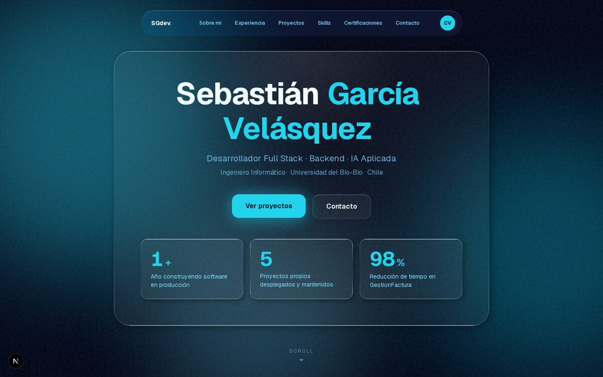

<div align="center">

# Sebastián García — Portfolio

**Portafolio profesional de [Sebastián García Velásquez](https://github.com/SRGarciaVel)** — Desarrollador Full Stack especializado en backend, datos e IA aplicada.

[](https://sgdev-portfolio.vercel.app)

[](https://nextjs.org)
[](https://react.dev)
[](https://www.typescriptlang.org)
[](https://tailwindcss.com)
[](https://gsap.com)

</div>



## Sobre este proyecto

Portafolio personal construido con Next.js (App Router) y TypeScript. El fondo y las superficies "glass" del sitio cambian de paleta según la hora del día y la estación del año en Chile, así que nunca se ve exactamente igual dos veces.

- **Server Components por defecto** — la paleta de color se lee del contexto solo donde hay interactividad real, no en el árbol completo de la página.
- **GSAP** para scroll-reveals, timelines y parallax, respetando `prefers-reduced-motion` en cada animación ambiental.
- **SEO completo** — metadata, `robots.ts`, `sitemap.ts`, imagen Open Graph generada con `next/og` y structured data (`Person`).
- **Un solo motor de animación** — sin dependencias de UI redundantes.

## Stack

| Capa | Tecnología |
|---|---|
| Framework | Next.js 16 (App Router, Turbopack) |
| Lenguaje | TypeScript |
| Estilos | Tailwind CSS 4 |
| Animación | GSAP · ScrollTrigger · ScrollSmoother |
| Iconos | lucide-react |
| Hosting | Vercel |

## Correr el proyecto localmente

```bash
git clone https://github.com/SRGarciaVel/portfolio.git
cd portfolio
npm install
npm run dev
```

Abre [http://localhost:3000](http://localhost:3000).

```bash
npm run lint    # ESLint
npm run build   # Build de producción
```

## Contacto

[](https://github.com/SRGarciaVel)
[](https://www.linkedin.com/in/sebasti%C3%A1n-garc%C3%ADa-vel%C3%A1squez/)
[](mailto:sebastian.rgarciavelasquez@gmail.com)
